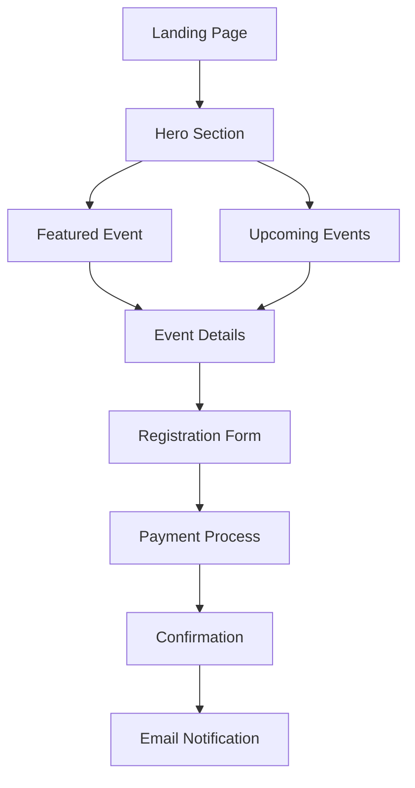
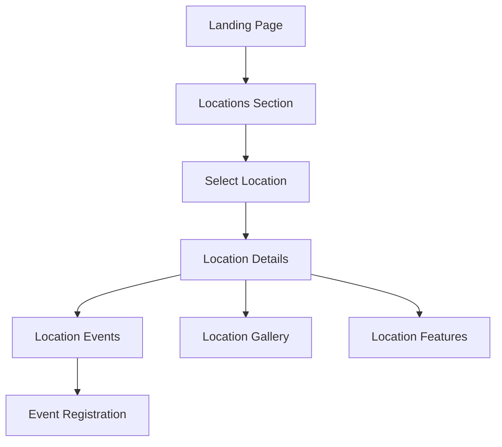
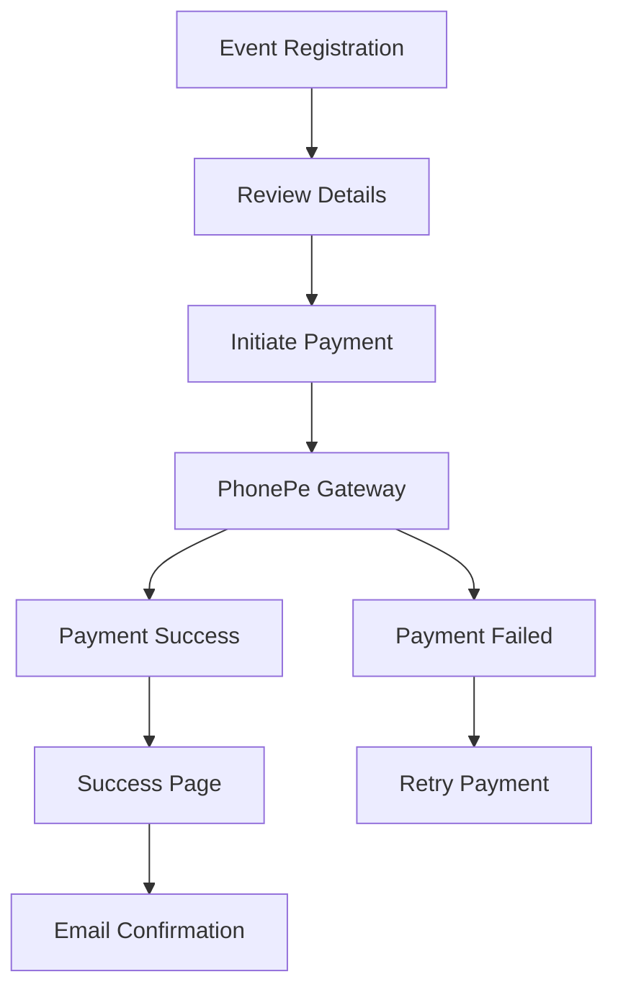

# User Flow Documentation

## Main User Journeys

### 1. Event Discovery & Registration

### 2. Location Exploration

### 3. Payment Flow

## Page-Specific Flows

### Home Page
1. **Initial Landing**
   - Responsive hero section with video/image fallback
   - Featured upcoming event
   - Quick event registration access
   - Newsletter subscription

2. **Event Showcase**
   - Browse upcoming events
   - Filter by location/date
   - View event details
   - Quick registration buttons

### Event Pages
1. **Event Information**
   - Event details and schedule
   - Location information
   - Pricing options
   - Food & accommodation details
   - Image gallery
   - Available slots

2. **Registration Process**
   - Personal information
   - Ticket selection
   - Add-on options
   - Payment processing
   - Confirmation

### Location Pages
1. **Location Overview**
   - Location description
   - Features & highlights
   - Photo gallery
   - Upcoming events
   - Past events showcase

2. **Location-specific Content**
   - Facilities
   - Accommodation options
   - Travel information
   - Weather conditions
   - Local attractions

## Interactive Elements

### Forms
1. **Event Registration**
   - Personal details
   - Ticket quantity
   - Food preferences
   - Special requirements
   - Mobile-responsive layout

2. **Payment Process**
   - Order summary
   - Amount breakdown
   - Secure payment gateway
   - Transaction recovery
   - Payment confirmation

3. **Newsletter Subscription**
   - Email input
   - Source tracking
   - Subscription confirmation
   - Welcome email

### Navigation
1. **Main Menu**
   - Mobile-friendly hamburger menu
   - Events listing
   - Locations
   - About section
   - Contact information

2. **Event Navigation**
   - Event categories
   - Date filters
   - Location filters
   - Search functionality

## User States

### Anonymous User
- Browse events and locations
- View public content
- Subscribe to newsletter
- Contact support

### Registered User
- Register for events
- View booking history
- Manage preferences
- Access exclusive content

## Error Handling

### Form Validation
- Real-time field validation
- Mobile-friendly error messages
- Clear error recovery paths
- Validation state persistence

### Payment Error Handling
- Transaction logging
- Payment retry options
- Error notifications
- Support contact options
- Session recovery

### System Errors
- Graceful fallbacks
- Loading states
- Error boundaries
- Mobile-optimized error pages
- Offline support

## Success Scenarios

### Event Registration
1. Form submission
2. Payment processing
3. Transaction confirmation
4. Email notification
5. Calendar invitation
6. SMS confirmation (optional)

### Payment Completion
1. Transaction verification
2. Database updates
3. Success notification
4. Email confirmation
5. Receipt generation
6. Registration status update

### Newsletter Subscription
1. Form validation
2. Database entry
3. Welcome email
4. Preference center
5. Subscription tracking

## Mobile Optimization

### Responsive Design
- Fluid typography
- Touch-friendly buttons
- Optimized images
- Adaptive layouts
- Performance optimization

### Mobile Interactions
- Touch gestures
- Form optimization
- Loading indicators
- Offline capabilities
- Share functionality

### Mobile-specific Features
- Click-to-call
- Maps integration
- Share to social
- Add to home screen
- Push notifications (future) 